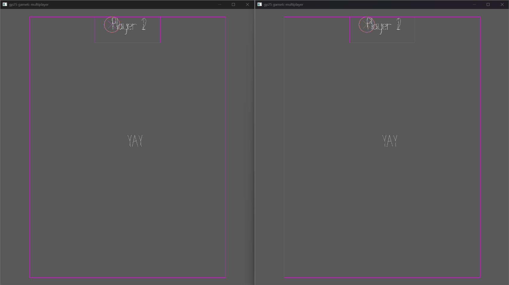

# Push and Shove

Author: Raeshana Sookhoo

Design: Player movement is restricted along one axis.

Networking: A server is responsible for sharing the game state and client information between clients.
Each client uses all the information given to render their scene.
This includes the win condition (each client checks if all clients are in the box).
Even-numbered clients set their isVertical flag to true, indicating to ignore horizontal input for this player.
The opposite occurs for odd-numbered clients.

Screen Shot:

How To Play:

This game is ideally a 2-player game (but can work with more).
Even-numbered players can move vertically.
Odd-numbered players can move horizontally.
Align your players in such a way that you can push and shove each other to the exit area.

Sources: (TODO: list a source URL for any assets you did not create yourself. Make sure you have a license for the asset.)

This game was built with [NEST](NEST.md).

